# 🎵 Music Recommender Simulation

## Project Summary

In this project you will build and explain a small music recommender system.

Your goal is to:

- Represent songs and a user "taste profile" as data
- Design a scoring rule that turns that data into recommendations
- Evaluate what your system gets right and wrong
- Reflect on how this mirrors real world AI recommenders

Replace this paragraph with your own summary of what your version does.

---

## How The System Works

Real-world music recommenders like Spotify and NetEase Cloud Music use two main approaches: collaborative filtering, which finds songs by looking at what similar users enjoyed, and content-based filtering, which matches song attributes (like energy, tempo, and mood) to a user's taste profile. Production systems combine both into hybrid models and layer on deep learning, social signals, and contextual data. Our simulation focuses on content-based filtering only, since we work with a single user profile and a small 10-song catalog rather than millions of users. This keeps the logic transparent and explainable while still demonstrating the core idea: turning song features and user preferences into a numerical score, then ranking by that score to surface the best matches.

- **Song features scored**: genre, mood, energy, acousticness, instrumentalness, popularity (plus tempo_bpm, valence, danceability stored but not scored)
- **UserProfile stores**: favorite_genre, favorite_mood, target_energy, likes_acoustic, prefers_instrumental, prefers_popular
- **Scoring**: Each song is scored out of 5.5 points using weighted feature matching — genre match (2.0 pts), mood match (1.0 pt), energy closeness (up to 1.0 pt), acousticness match (0.5 pt), instrumentalness match (0.5 pt), and popularity match (0.5 pt). Energy closeness uses a distance formula (`1 - |target_energy - song_energy|`) to reward closeness rather than raw magnitude. Boolean attributes are thresholded at 0.5 before comparison.
- **Ranking**: Songs are sorted by score descending, and the top-k are returned as recommendations.

### Data Flow

```mermaid
flowchart TD
    A["songs.csv\n18 rows x 12 columns"] -->|"load_songs()\ncsv.DictReader parses each row"| B["songs: List of Dict\n18 song dictionaries"]
    U["User Prefs\nfavorite_genre: lofi\nfavorite_mood: chill\ntarget_energy: 0.40"] --> D

    B -->|"for song in songs"| C["Pick next song"]
    C --> D{"score_song()"}

    D --> E{"genre == favorite_genre?"}
    E -->|Yes| F["+2.0 points"]
    E -->|No| G["+0.0 points"]

    F --> H{"mood == favorite_mood?"}
    G --> H

    H -->|Yes| I["+1.0 points"]
    H -->|No| J["+0.0 points"]

    I --> K["Energy similarity\n+1.0 x (1 - |energy - target|)"]
    J --> K

    K --> K2{"acousticness > 0.5\n== likes_acoustic?"}
    K2 -->|Yes| K3["+0.5 points"]
    K2 -->|No| K4["+0.0 points"]
    K3 --> K5{"instrumentalness > 0.5\n== prefers_instrumental?"}
    K4 --> K5
    K5 -->|Yes| K6["+0.5 points"]
    K5 -->|No| K7["+0.0 points"]
    K6 --> K8{"popularity > 0.5\n== prefers_popular?"}
    K7 --> K8
    K8 -->|Yes| K9["+0.5 points"]
    K8 -->|No| K10["+0.0 points"]
    K9 --> L["Total score: 0.0 - 5.5\n+ explanation string"]
    K10 --> L
    L --> M["Append (song, score, explanation)\nto scored list"]

    M --> N{"More songs?"}
    N -->|Yes| C
    N -->|No| O["Sort scored list\nby score descending"]

    O --> P["Slice top k = 5"]
    P --> Q["Output:\n1. Library Rain      5.45\n2. Midnight Coding   4.98\n3. Focus Flow        4.50\n4. Spacewalk Thoughts 3.38\n5. Echoes of Kyoto   2.43"]
```

### Algorithm Recipe

**Step 1 — Score each song (Scoring Rule)**

Each song is scored out of 5.5 points against the user's taste profile:

| Rule | Type | Max Points | Formula |
|------|------|-----------|---------|
| Genre match | Categorical | 2.0 | `song.genre == user.favorite_genre` → 2.0, else 0 |
| Mood match | Categorical | 1.0 | `song.mood == user.favorite_mood` → 1.0, else 0 |
| Energy closeness | Numerical | 1.0 | `(1 - |user.target_energy - song.energy|) × 1.0` |
| Acousticness match | Boolean | 0.5 | `(song.acousticness > 0.5) == user.likes_acoustic` → 0.5, else 0 |
| Instrumentalness match | Boolean | 0.5 | `(song.instrumentalness > 0.5) == user.prefers_instrumental` → 0.5, else 0 |
| Popularity match | Boolean | 0.5 | `(song.popularity > 0.5) == user.prefers_popular` → 0.5, else 0 |

- **Categorical**: exact string match = full points, mismatch = 0
- **Numerical**: continuous distance formula (`1 - |diff|`) provides a smooth gradient — no hard cutoff
- **Boolean**: song's float value is thresholded at 0.5, then compared to user's boolean preference

**Step 2 — Rank all songs (Ranking Rule)**

1. Compute score for every song in the catalog
2. Sort by score descending
3. Return the top k results (default k=5)

**Step 3 — Explain each recommendation**

For each recommended song, generate a human-readable explanation listing which features matched and the energy similarity score.

**Design Principles:**
- Genre carries the most weight (2.0 pts, 36% of max score) as the strongest "vibe" indicator, followed by Mood (1.0 pt, 18%) and Energy closeness (1.0 pt, 18%) as secondary signals, then Acousticness, Instrumentalness, and Popularity (0.5 pts each, 9% each) as tiebreakers.
- The system avoids binary rejection. A high-energy song can still appear in a "Chill" profile if other attributes align strongly (e.g., matching genre, mood, and boolean preferences), though it will rank lower. This mirrors how real listeners sometimes enjoy songs outside their usual comfort zone when enough other qualities resonate.

### Potential Biases

- **Genre tunnel vision (流派隧道视角)**: Genre is worth 2.0 of the 5.5 possible points (36%). A song that matches genre alone can outscore one that matches mood, energy, and all three boolean attributes but not genre (max 3.5 without genre). This means the system might always recommend Lofi to a Lofi fan, even if a Rock song's energy and mood perfectly match their current state — it gets buried because of the genre mismatch.
- **Mood rigidity**: Mood is also an exact match. A user who prefers "chill" gets zero mood points for a "relaxed" song, even though these moods are subjectively very close.
- **Catalog bias**: The 18-song catalog has uneven genre representation. Genres with more songs (e.g., lofi has 3) naturally have more candidates to score well, while genres with only 1 song leave no room for ranking variation.
- **No discovery**: Because genre match dominates, the system reinforces existing preferences and rarely surfaces songs outside the user's comfort zone — a "filter bubble" effect common in real recommender systems.
- **Limited continuous scoring**: Energy closeness is the only attribute scored on a continuous scale. Two songs in the same genre and mood with matching boolean attributes are differentiated solely by energy, ignoring tempo, valence, and danceability even though those are available in the data.

---

## Getting Started

### Setup

1. Create a virtual environment (optional but recommended):

   ```bash
   python -m venv .venv
   source .venv/bin/activate      # Mac or Linux
   .venv\Scripts\activate         # Windows

2. Install dependencies

```bash
pip install -r requirements.txt
```

3. Run the app:

```bash
python3 -m src.main
```

### Running Tests

Run the starter tests with:

```bash
pytest
```

You can add more tests in `tests/test_recommender.py`.

## Screeshots:

### 1) Phase 3: Implementation- Step 4: CLI Verification

A screenshot of terminal output showing the recommendations (song titles, scores, and reasons).

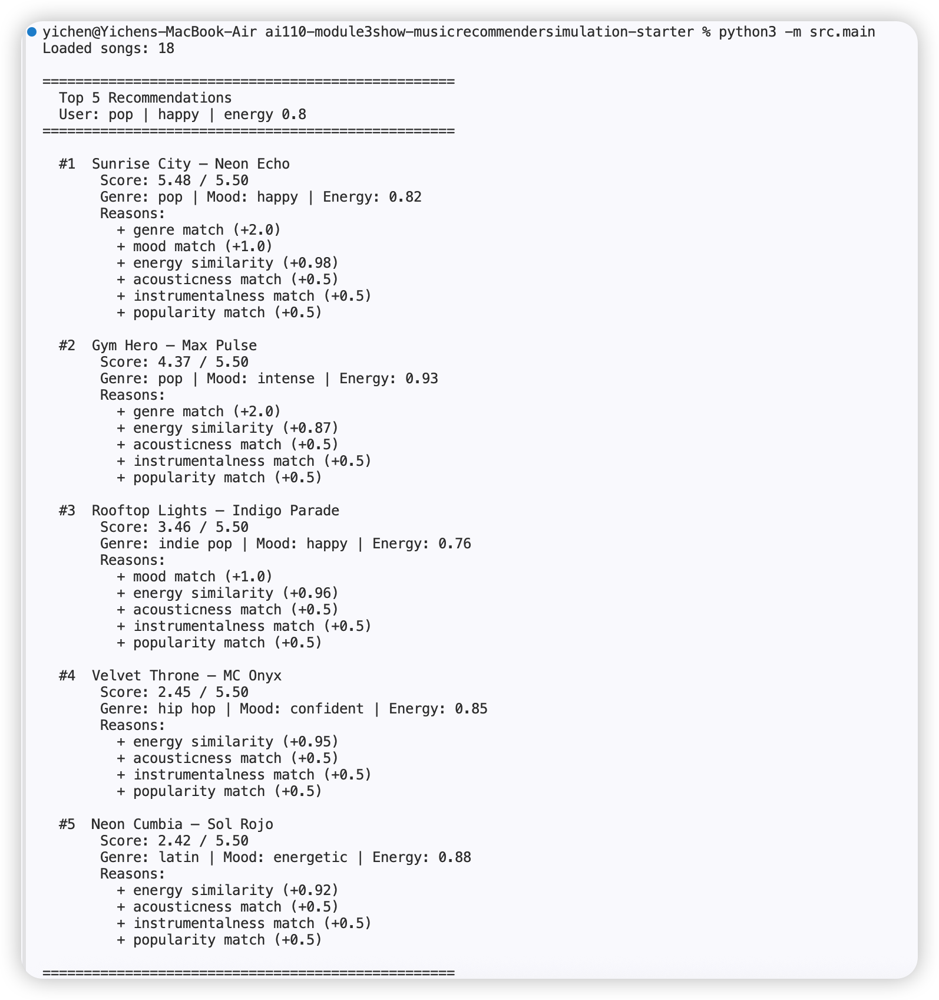

### 2) Phase 4: Evaluation and Explanation- Step 1: Stress Test with Diverse Profiles

a **screenshot** of terminal output for each profile's recommendations.

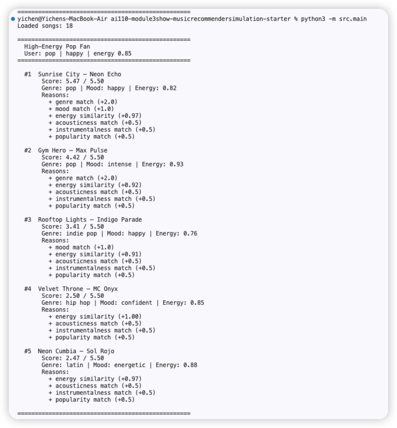

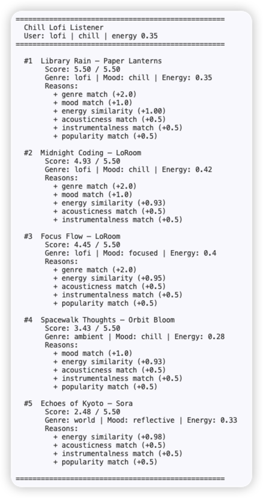

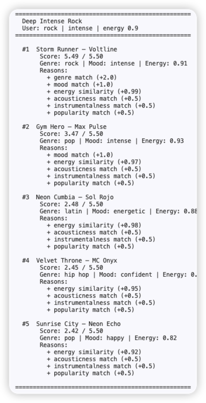

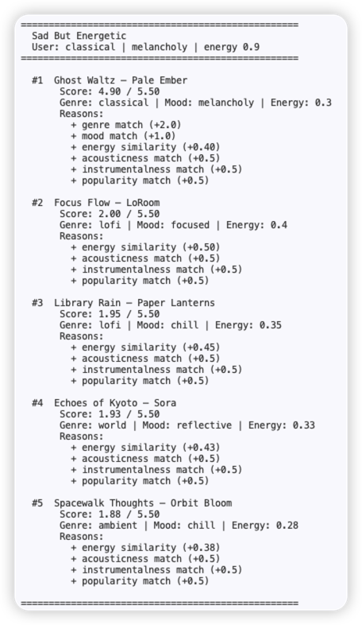

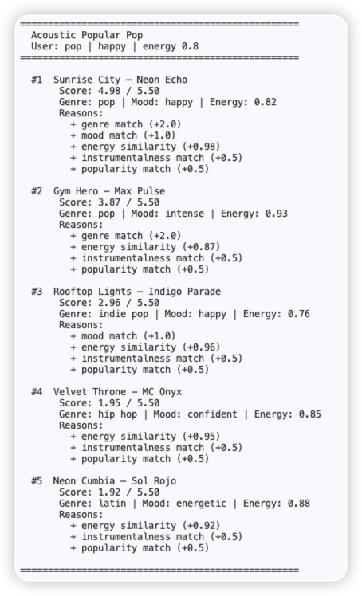

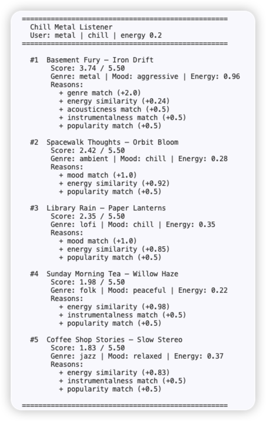

### 3) After implementing four challenges, the screenshots show as follows:

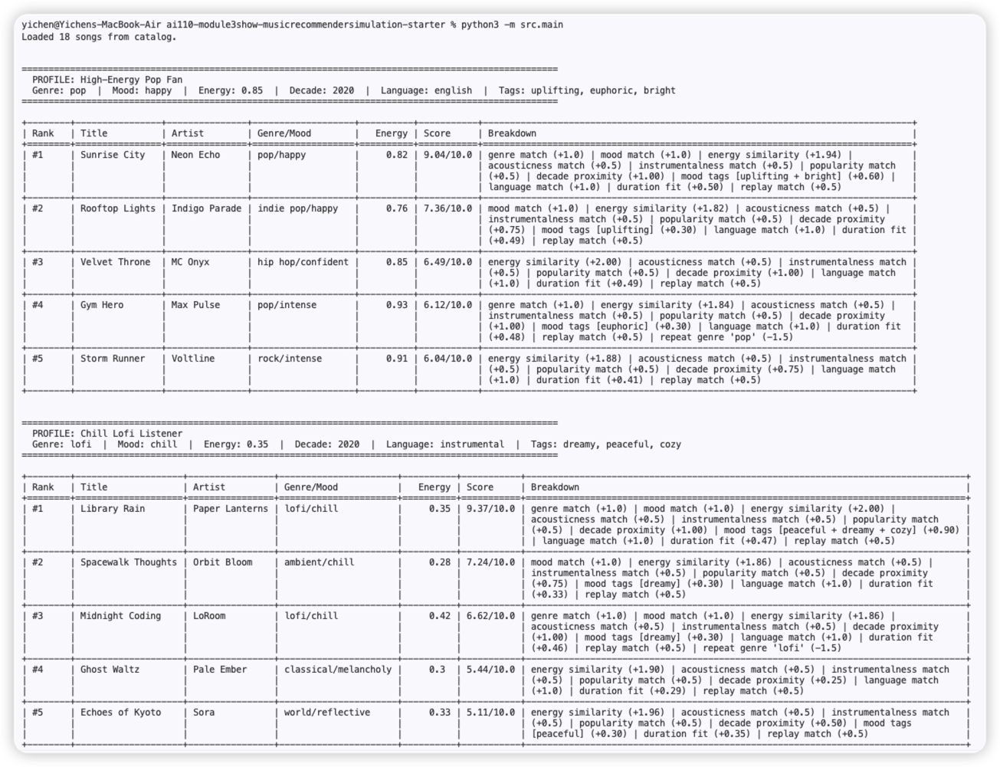

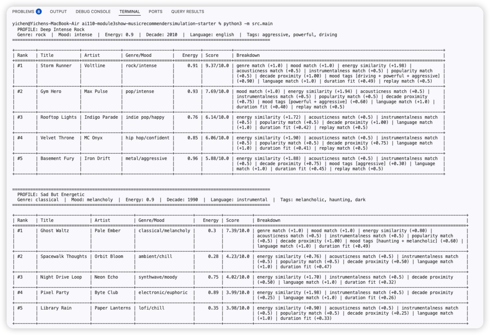

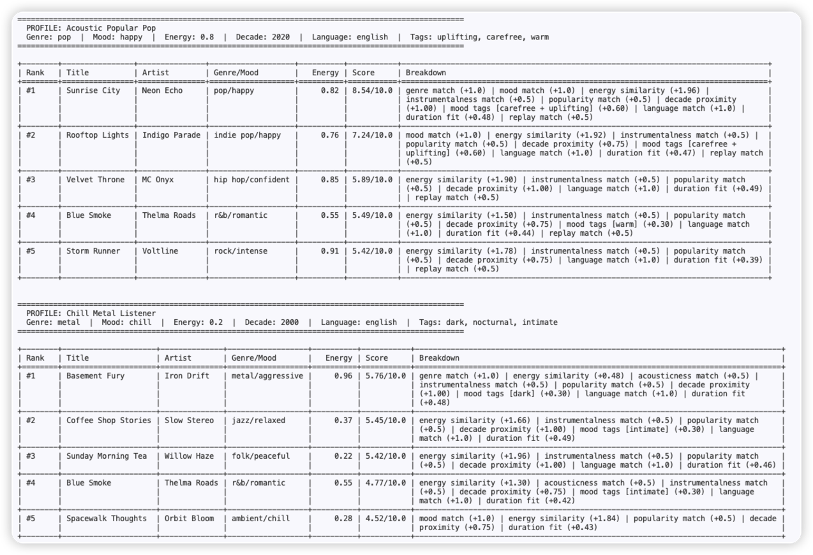

---

## Experiments You Tried

### Experiment 1: Weight Shift (Genre 2.0 → 1.0, Energy 1.0 → 2.0)

We noticed that genre at 2.0 was acting like a trump card. For the Chill Metal Listener (metal, chill, energy 0.2), the system recommended Basement Fury (aggressive, energy 0.96) as #1 simply because it matched on genre. The user asked for calm music and got the loudest song in the catalog.

We halved genre to 1.0 and doubled energy to 2.0. Results:
- Chill Metal Listener: Spacewalk Thoughts (chill, energy 0.28) rose to #1. Basement Fury dropped to #3. This felt much more accurate.
- All three standard profiles (Pop Fan, Lofi Listener, Rock Fan) kept the same #1 songs. The change only affected cases where preferences conflicted.

### Experiment 2: Adversarial User Profiles

We added three profiles designed to break the system:
- **Sad But Energetic** (classical, melancholy, energy 0.9): Exposed that Ghost Waltz wins despite a huge energy mismatch because it is the only classical + melancholy song.
- **Acoustic Popular Pop** (pop, happy, acoustic): Exposed that the 0.5-point acoustic bonus cannot compete with genre + mood. Sunrise City wins even though it is not acoustic at all.
- **Chill Metal Listener** (metal, chill, energy 0.2): Exposed genre dominance (fixed by Experiment 1).

### Experiment 3: Math Verification

We hand-calculated scores for Basement Fury (2.98) and Spacewalk Thoughts (3.34) under the new weights, checking each feature line by line. All calculations matched the program output. We also confirmed the max score cannot exceed 5.50.

---

## Limitations and Risks

- **Tiny catalog**: Only 18 songs. Most genres have just 1 song, so there is no real ranking within a genre — the system just picks the only option and fills the rest with unrelated songs.
- **Exact string matching**: "Pop" and "indie pop" get zero partial credit. "Chill" and "relaxed" are treated as completely different moods. Small wording differences cost a full 1.0 points.
- **Ignored features**: Tempo, valence, and danceability are in the CSV but never used. Dance-oriented and tempo-sensitive listeners are invisible to the system.
- **Boolean features too weak**: Acoustic, instrumental, and popularity are worth 0.5 each. A user who explicitly asks for acoustic music still gets non-acoustic songs because 0.5 points cannot compete with genre + mood + energy.
- **No language or lyrics**: The system knows nothing about what a song sounds like or what language it is in.
- **Popularity feedback loop**: Popular songs get +0.5 for mainstream users. Niche songs can never earn that bonus, so they stay buried.

See [model_card.md](model_card.md) for a deeper analysis.

---

## Reflection

Read and complete `model_card.md`:

[**Model Card**](model_card.md)

### What I learned about how recommenders turn data into predictions

My biggest learning moment was seeing how one number can break everything. Genre weight at 2.0 seemed reasonable — of course genre matters most, right? But when the Chill Metal Listener got Basement Fury (aggressive, energy 0.96) as their #1 recommendation, it was obvious that "most important" and "overrides everything else" are not the same thing. Changing genre to 1.0 and energy to 2.0 fixed the worst case without breaking any of the normal profiles. That taught me that tuning weights is not about finding the "correct" value. It is about finding a balance where no single feature can drown out all the others.

I was also surprised that six if-statements and basic addition can feel like real recommendations. When Library Rain scored a perfect 5.50 for the Lofi Listener, it genuinely seemed like the system understood that user. It did not. It just added up numbers. The illusion works when preferences align cleanly with the catalog. It breaks when they conflict — and that is exactly what the adversarial profiles exposed.

### Where bias and unfairness show up

Using AI tools (Claude) helped me spot patterns I would have missed — like the fact that acoustic songs in my CSV are almost never popular, which creates a hidden conflict. But I still had to hand-verify every score calculation. AI is fast at generating ideas, but trusting the output without checking the math would have been a mistake.

The biggest source of unfairness is the catalog itself. Classical, metal, folk, and world each have 1 song. A user who likes any of those genres gets the same #1 every single time, then a wall of random results. Pop and lofi users get variety because those genres have 2-3 songs. The scoring logic is the same for everyone, but the experience is not — and that is a form of bias that lives in the data, not the algorithm. In a real product, this could mean entire communities of listeners feel ignored, not because the system is broken, but because nobody added enough music that represents them.

---

## Challenge Implementations

### Challenge 1: Advanced Song Features

Added 5 new attributes to `data/songs.csv` and scoring logic in `src/recommender.py`:

| Feature | Column | Type | Scoring Rule | Max Points |
|---------|--------|------|--------------|------------|
| Release Decade | `release_decade` | int (1990–2020) | `1.0 × (1 - |user_decade - song_decade| / 40)` — closer decades score higher | 1.0 |
| Mood Tags | `mood_tags` | pipe-separated strings | 0.3 per matching tag, capped at 1.5 | 1.5 |
| Lyrics Language | `lyrics_language` | string (english, instrumental, spanish, japanese) | Exact match = +1.0 | 1.0 |
| Duration | `duration_sec` | int (seconds) | `0.5 × (1 - |diff| / 300)` — 5-minute tolerance | 0.5 |
| Replay Value | `replay_value` | float 0–1 | Boolean threshold at 0.5, match = +0.5 | 0.5 |

Max score increased from 5.5 to 10.0 (Balanced mode). User profiles in `main.py` were updated with matching preferences (`preferred_decade`, `liked_mood_tags`, `preferred_language`, `target_duration_sec`, `values_replayability`).

### Challenge 2: Multiple Scoring Modes (Strategy Pattern)

Implemented three scoring modes via a `SCORING_MODES` dictionary in `recommender.py`. The `score_song()` function accepts a `mode` parameter and reads weights from the corresponding dictionary. No scoring logic is duplicated — only the weights change.

| Feature | Balanced | Genre-First | Energy-Focused |
|---------|----------|-------------|----------------|
| Genre | 1.0 | **3.0** | 0.5 |
| Mood | 1.0 | 1.5 | 0.5 |
| Energy | **2.0** | 1.0 | **3.0** |
| Acoustic / Instrumental / Popularity | 0.5 each | 0.5 each | 0.5 each |
| Decade | 1.0 | 0.5 | 0.5 |
| Mood Tags (per tag) | 0.3 | 0.3 | 0.5 |
| Language | 1.0 | 0.5 | 0.5 |
| Duration | 0.5 | 0.25 | 0.5 |
| Replay | 0.5 | 0.25 | 0.5 |

Example result — Chill Metal Listener's #1 per mode:
- **Genre-First**: Basement Fury (6.28) — genre=3.0 dominates
- **Balanced**: Basement Fury (5.76) — decade + language bonuses help
- **Energy-Focused**: Coffee Shop Stories (5.48) — energy=3.0 rewards low-energy match

### Challenge 3: Diversity and Fairness Logic

Added a diversity penalty in `recommend_songs()` using greedy selection. When `diverse=True`, the system picks songs one at a time and penalizes candidates that share an artist or genre with already-picked songs:

- **Repeat artist**: -3.0 per occurrence (heavy — same artist twice feels repetitive)
- **Repeat genre**: -1.5 per occurrence (lighter — same genre twice is less jarring)
- Penalties **stack** — the first repeat costs -1.5 or -3.0, the second costs double

Example — Chill Lofi Listener top 3:

| Rank | Without Diversity | With Diversity |
|------|-------------------|----------------|
| #1 | Library Rain (lofi, Paper Lanterns) 9.37 | Library Rain (lofi, Paper Lanterns) 9.37 |
| #2 | Midnight Coding (lofi, **LoRoom**) 8.12 | **Spacewalk Thoughts (ambient, Orbit Bloom) 7.24** |
| #3 | Focus Flow (lofi, **LoRoom**) 7.33 | Midnight Coding (lofi, LoRoom) 6.62 (-1.5 genre) |

Without diversity: 3 lofi songs, 2 by LoRoom. With diversity: ambient track surfaces at #2, user discovers new music.

### Challenge 4: Visual Summary Table

Replaced plain-text output with `tabulate` library (`pip install tabulate`, added to `requirements.txt`). Output now has two layers per mode:

**1. Summary table** — bordered table for quick scanning:
```
┌────────┬────────────────┬───────────────┬───────┬───────┬────────┬─────────────┐
│ Rank   │ Title          │ Artist        │ Genre │ Mood  │ Energy │ Score       │
├────────┼────────────────┼───────────────┼───────┼───────┼────────┼─────────────┤
│ #1     │ Sunrise City   │ Neon Echo     │ pop   │ happy │   0.82 │ 9.04 / 10.0 │
│ #2     │ Gym Hero       │ Max Pulse     │ pop   │ intense│  0.93 │ 7.62 / 10.0 │
└────────┴────────────────┴───────────────┴───────┴───────┴────────┴─────────────┘
```

**2. Detail cards** — per-song breakdown with `+` for scoring bonuses and `-` for diversity penalties:
```
  #3  Midnight Coding — LoRoom  [6.62/10.0, 66%]
  ──────────────────────────────────────────────────
  + genre match (+1.0)
  + mood match (+1.0)
  + energy similarity (+1.86)
  ...
  - repeat genre 'lofi' (-1.5)
```

Key files modified: `src/main.py` (display functions `print_summary_table()`, `print_detail_cards()`), `src/recommender.py` (scoring modes, diversity logic), `data/songs.csv` (5 new columns), `requirements.txt` (added tabulate).

Run with: `python3 -m src.main`

