# 🎵 Music Recommender Simulation

## Project Summary

In this project you will build and explain a small music recommender system.

Your goal is to:

- Represent songs and a user "taste profile" as data
- Design a scoring rule that turns that data into recommendations
- Evaluate what your system gets right and wrong
- Reflect on how this mirrors real world AI recommenders

Replace this paragraph with your own summary of what your version does.

---

## How The System Works

Real-world music recommenders like Spotify and NetEase Cloud Music use two main approaches: collaborative filtering, which finds songs by looking at what similar users enjoyed, and content-based filtering, which matches song attributes (like energy, tempo, and mood) to a user's taste profile. Production systems combine both into hybrid models and layer on deep learning, social signals, and contextual data. Our simulation focuses on content-based filtering only, since we work with a single user profile and a small 10-song catalog rather than millions of users. This keeps the logic transparent and explainable while still demonstrating the core idea: turning song features and user preferences into a numerical score, then ranking by that score to surface the best matches.

- **Song features scored**: genre, mood, energy, acousticness, instrumentalness, popularity (plus tempo_bpm, valence, danceability stored but not scored)
- **UserProfile stores**: favorite_genre, favorite_mood, target_energy, likes_acoustic, prefers_instrumental, prefers_popular
- **Scoring**: Each song is scored out of 5.5 points using weighted feature matching — genre match (2.0 pts), mood match (1.0 pt), energy closeness (up to 1.0 pt), acousticness match (0.5 pt), instrumentalness match (0.5 pt), and popularity match (0.5 pt). Energy closeness uses a distance formula (`1 - |target_energy - song_energy|`) to reward closeness rather than raw magnitude. Boolean attributes are thresholded at 0.5 before comparison.
- **Ranking**: Songs are sorted by score descending, and the top-k are returned as recommendations.

### Data Flow

```mermaid
flowchart TD
    A["songs.csv\n18 rows x 12 columns"] -->|"load_songs()\ncsv.DictReader parses each row"| B["songs: List of Dict\n18 song dictionaries"]
    U["User Prefs\nfavorite_genre: lofi\nfavorite_mood: chill\ntarget_energy: 0.40"] --> D

    B -->|"for song in songs"| C["Pick next song"]
    C --> D{"score_song()"}

    D --> E{"genre == favorite_genre?"}
    E -->|Yes| F["+2.0 points"]
    E -->|No| G["+0.0 points"]

    F --> H{"mood == favorite_mood?"}
    G --> H

    H -->|Yes| I["+1.0 points"]
    H -->|No| J["+0.0 points"]

    I --> K["Energy similarity\n+1.0 x (1 - |energy - target|)"]
    J --> K

    K --> K2{"acousticness > 0.5\n== likes_acoustic?"}
    K2 -->|Yes| K3["+0.5 points"]
    K2 -->|No| K4["+0.0 points"]
    K3 --> K5{"instrumentalness > 0.5\n== prefers_instrumental?"}
    K4 --> K5
    K5 -->|Yes| K6["+0.5 points"]
    K5 -->|No| K7["+0.0 points"]
    K6 --> K8{"popularity > 0.5\n== prefers_popular?"}
    K7 --> K8
    K8 -->|Yes| K9["+0.5 points"]
    K8 -->|No| K10["+0.0 points"]
    K9 --> L["Total score: 0.0 - 5.5\n+ explanation string"]
    K10 --> L
    L --> M["Append (song, score, explanation)\nto scored list"]

    M --> N{"More songs?"}
    N -->|Yes| C
    N -->|No| O["Sort scored list\nby score descending"]

    O --> P["Slice top k = 5"]
    P --> Q["Output:\n1. Library Rain      5.45\n2. Midnight Coding   4.98\n3. Focus Flow        4.50\n4. Spacewalk Thoughts 3.38\n5. Echoes of Kyoto   2.43"]
```



### Algorithm Recipe

**Step 1 — Score each song (Scoring Rule)**

Each song is scored out of 5.5 points against the user's taste profile:

| Rule | Type | Max Points | Formula |
|------|------|-----------|---------|
| Genre match | Categorical | 2.0 | `song.genre == user.favorite_genre` → 2.0, else 0 |
| Mood match | Categorical | 1.0 | `song.mood == user.favorite_mood` → 1.0, else 0 |
| Energy closeness | Numerical | 1.0 | `(1 - |user.target_energy - song.energy|) × 1.0` |
| Acousticness match | Boolean | 0.5 | `(song.acousticness > 0.5) == user.likes_acoustic` → 0.5, else 0 |
| Instrumentalness match | Boolean | 0.5 | `(song.instrumentalness > 0.5) == user.prefers_instrumental` → 0.5, else 0 |
| Popularity match | Boolean | 0.5 | `(song.popularity > 0.5) == user.prefers_popular` → 0.5, else 0 |

- **Categorical**: exact string match = full points, mismatch = 0
- **Numerical**: continuous distance formula (`1 - |diff|`) provides a smooth gradient — no hard cutoff
- **Boolean**: song's float value is thresholded at 0.5, then compared to user's boolean preference

**Step 2 — Rank all songs (Ranking Rule)**

1. Compute score for every song in the catalog
2. Sort by score descending
3. Return the top k results (default k=5)

**Step 3 — Explain each recommendation**

For each recommended song, generate a human-readable explanation listing which features matched and the energy similarity score.

**Design Principles:**
- Genre carries the most weight (2.0 pts, 36% of max score) as the strongest "vibe" indicator, followed by Mood (1.0 pt, 18%) and Energy closeness (1.0 pt, 18%) as secondary signals, then Acousticness, Instrumentalness, and Popularity (0.5 pts each, 9% each) as tiebreakers.
- The system avoids binary rejection. A high-energy song can still appear in a "Chill" profile if other attributes align strongly (e.g., matching genre, mood, and boolean preferences), though it will rank lower. This mirrors how real listeners sometimes enjoy songs outside their usual comfort zone when enough other qualities resonate.

### Potential Biases

- **Genre tunnel vision (流派隧道视角)**: Genre is worth 2.0 of the 5.5 possible points (36%). A song that matches genre alone can outscore one that matches mood, energy, and all three boolean attributes but not genre (max 3.5 without genre). This means the system might always recommend Lofi to a Lofi fan, even if a Rock song's energy and mood perfectly match their current state — it gets buried because of the genre mismatch.
- **Mood rigidity**: Mood is also an exact match. A user who prefers "chill" gets zero mood points for a "relaxed" song, even though these moods are subjectively very close.
- **Catalog bias**: The 18-song catalog has uneven genre representation. Genres with more songs (e.g., lofi has 3) naturally have more candidates to score well, while genres with only 1 song leave no room for ranking variation.
- **No discovery**: Because genre match dominates, the system reinforces existing preferences and rarely surfaces songs outside the user's comfort zone — a "filter bubble" effect common in real recommender systems.
- **Limited continuous scoring**: Energy closeness is the only attribute scored on a continuous scale. Two songs in the same genre and mood with matching boolean attributes are differentiated solely by energy, ignoring tempo, valence, and danceability even though those are available in the data.

---

## Getting Started

### Setup

1. Create a virtual environment (optional but recommended):

   ```bash
   python -m venv .venv
   source .venv/bin/activate      # Mac or Linux
   .venv\Scripts\activate         # Windows

2. Install dependencies

```bash
pip install -r requirements.txt
```

3. Run the app:

```bash
python3 -m src.main
```

### Running Tests

Run the starter tests with:

```bash
pytest
```

You can add more tests in `tests/test_recommender.py`.

A screenshot of terminal output showing the recommendations (song titles, scores, and reasons).


---

## Experiments You Tried

Use this section to document the experiments you ran. For example:

- What happened when you changed the weight on genre from 2.0 to 0.5
- What happened when you added tempo or valence to the score
- How did your system behave for different types of users

---

## Limitations and Risks

Summarize some limitations of your recommender.

Examples:

- It only works on a tiny catalog
- It does not understand lyrics or language
- It might over favor one genre or mood

You will go deeper on this in your model card.

---

## Reflection

Read and complete `model_card.md`:

[**Model Card**](model_card.md)

Write 1 to 2 paragraphs here about what you learned:

- about how recommenders turn data into predictions
- about where bias or unfairness could show up in systems like this


---

## 7. `model_card_template.md`

Combines reflection and model card framing from the Module 3 guidance. :contentReference[oaicite:2]{index=2}  

```markdown
# 🎧 Model Card - Music Recommender Simulation

## 1. Model Name

Give your recommender a name, for example:

> VibeFinder 1.0

---

## 2. Intended Use

- What is this system trying to do
- Who is it for

Example:

> This model suggests 3 to 5 songs from a small catalog based on a user's preferred genre, mood, and energy level. It is for classroom exploration only, not for real users.

---

## 3. How It Works (Short Explanation)

Describe your scoring logic in plain language.

- What features of each song does it consider
- What information about the user does it use
- How does it turn those into a number

Try to avoid code in this section, treat it like an explanation to a non programmer.

---

## 4. Data

Describe your dataset.

- How many songs are in `data/songs.csv`
- Did you add or remove any songs
- What kinds of genres or moods are represented
- Whose taste does this data mostly reflect

---

## 5. Strengths

Where does your recommender work well

You can think about:
- Situations where the top results "felt right"
- Particular user profiles it served well
- Simplicity or transparency benefits

---

## 6. Limitations and Bias

Where does your recommender struggle

Some prompts:
- Does it ignore some genres or moods
- Does it treat all users as if they have the same taste shape
- Is it biased toward high energy or one genre by default
- How could this be unfair if used in a real product

---

## 7. Evaluation

How did you check your system

Examples:
- You tried multiple user profiles and wrote down whether the results matched your expectations
- You compared your simulation to what a real app like Spotify or YouTube tends to recommend
- You wrote tests for your scoring logic

You do not need a numeric metric, but if you used one, explain what it measures.

---

## 8. Future Work

If you had more time, how would you improve this recommender

Examples:

- Add support for multiple users and "group vibe" recommendations
- Balance diversity of songs instead of always picking the closest match
- Use more features, like tempo ranges or lyric themes

---

## 9. Personal Reflection

A few sentences about what you learned:

- What surprised you about how your system behaved
- How did building this change how you think about real music recommenders
- Where do you think human judgment still matters, even if the model seems "smart"

